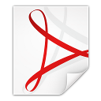

_🇬🇧 For English, see [README.md](README.md)_

# Neude

Digitalisering en ontwerp van Neude, een type in de stijl van de Amsterdamse School

> <em>Kunst wordt geboren uit de observatie en onderzoeking van de natuur.</em> — Cicero (106 – 43 v.Chr.) Romeins redenaar, politicus, advocaat en filosoof

## Inleiding

Een inleiding op dit lettertype is te vinden op de campagne bij [voordekunst](https://voordekunst.nl/projecten/4858-digitalisering-en-ontwerp-font-neude-1).

## Gebruik

Het lettertype Neude is gebruikt op omslag van en in het fotoboek genaamd [Neude 11](https://www.facebook.com/arjandenboer?hc_ref=ARRaCM_-EzutsElgoimdCYDplYEzzImclEtvNCukq0-6nYcQ6u3spPHdqw_scz3AGw0&fref=nf) van [Arjan den Boer](http://www.arjandenboer.nl), 2018.

Het lettertype Neude is gebruikt op de omslag van en in de dichtbundelgenaamd [Bokalen](https://uitgeverijcru.blogspot.nl/2017/02/bokalen.html) van [Nanne Nauta](https://nannenauta.blogspot.nl), 2017.

Ontwerp voor sponsoren van individuele letters gedurende de crowfundingcampagne, 2016.

Katoenen tas (_tote bag_) voor sponsoren gedurende de crowdfundingcampagne, 2016.

Postzegels voor sponsoren gedurende de crowfundingcampagne, 2016.

## Download

Versie 1.011, 20170811, 485 gliefen.

| OpenType-lettertype | TrueType-lettertype |
|---------------------|---------------------|
| Download het OTF-bestand   [Neude.otf](https://github.com/z25/neude/blob/master/Neude.otf?raw=true) (61 KB)    | Download het TTF-bestand   [Neude.ttf](https://github.com/z25/neude/blob/master/Neude.otf?raw=true) (39 KB)    |

<!--Download van het WOFF-bestand komt binnenkort.-->

## Specimen

| OpenType-specimen | TrueType-specimen |
|-------------------|-------------------|
| PDF-specimen van meerdere pagina's  [Neude-otf-fntsample.pdf](https://github.com/z25/neude/blob/master/specimens/Neude-otf-fntsample.pdf?raw=true) (87 KB)    | PDF-specimen van meerdere pagina's   [Neude-ttf-fntsample.pdf](https://github.com/z25/neude/blob/master/specimens/Neude-ttf-fntsample.pdf?raw=true) (82 KB)    |

Ondersteuning van alle cijfers zal binnenkort volgen.

## Licentie

Het originele ontwerp van dertien letters op de standbeelden die te vinden zijn in de hal van het [voormalige postkantoor]() aan het [Neude]() in [Utrecht]() zijn gemaakt door [Hendrik van den Eijnde](). Deze standbeelden zijn in de jaren '20 gemaakt en het auteursrecht erop is in 2009 verlopen, 70 jaar na de dood van de artiest.

Dit project, betreft de lettertypebestanden en documentatie, heeft een [Open Font License (OFL)](https://en.wikipedia.org/wiki/SIL_Open_Font_License). Deze licentie is te vindne in het bestand genaamd [LICENSE](LICENSE) maar ook op de website van de auteurs van de licentie, [SIL International](http://scripts.sil.org/cms/scripts/page.php?site_id=nrsi&item_id=OFL-FAQ_web).

De _font foundry_ voor dit lettertype is Stichting z25.org.

## Gereedschappen

De volgende software is gebruikt om dit font te creëren:

|   |   |
|---|---|
[Inkscape](http://inkscape.org)  | [FontForge](http://fontforge.github.io) 

<!--[fntsample](TODO)-->

## Sponsoren

Hoofdsponsor [a.s.r. vastgoed vermogensbeheer](http://asrvastgoedvermogensbeheer.nl) en [MRP Development](http://mrpdevelopment.nl)

|   |   |
|---|---|
Cofinanciering: [Gemeente Utrecht](http://utrecht.nl)  | Sponsor als partner van voordekunst: [Prins Bernhard Cultuurfonds](http://cultuurfonds.nl) 
Sponsor: [Museum Het Schip](http://hetschip.nl)  | Sponsor printed cotton bags: [Katoenfrabriek](http://katoenfabriek.nl) 

## Gesponsorde letters

De volgende letters zijn individueel gesponsord:
* **B** door Bibliotheek Utrecht http://bibliotheekutrecht.nl
* **H** door Hans by Hans van de Camp http://hansvandecamp.nl
* **Y** door Yppah by Sander Mulder http://www.yppah.com
* **Z** door Zorgtaal by Arnoud van den Eerenbeemt http://zorgtaal.eu

## Dankwoord

Dank gaat, in alfabetische volgorde, uit naar:

|   |   |
|---|---|
[Drents Museum](http://drentsmuseum.nl)  | [Arjan den Boer](http://arjandenboer.nl) 
[BYOB](http://byob.nl)  | Presentation at [FOSDEM 2017](http://fosdem.org/2017/schedule/event/osd_architectural_font_digitalisation/) 
Crowdfunding at [voordekunst](http://voordekunst.nl)  | [SETUP](http://setup.nl) 

Gastpresentatie met 3D-modellen van letters in winkeletalage in het stadscentrum van Utrecht:

|   |   |
|---|---|
[sudden](http://suddenprojects.nl)  | [Hellebaard](http://hellebaard.nl) 
[Stichting z25.org](http://z25.org)  | 

## Distributie

Neude is ook beschikbaar op de volgende lettertypewebsites, maar let op dat de meest recente versie eerst op hier op GitHub beschikbaar zal zijn:

|   |   |
|---|---|
[Font Library](http://fontlibrary.org/en/member/z25)  | [DaFont](http://dafont.com/profile.php?user=948889) 
[FontKe](https://eng.fontke.com/font/25062699/)  | [LikeFont](https://en.likefont.com/font/6022167/) 

## Nieuws

Neude was in het nieuws in de volgende artikelen:
- [indebuurt.nl/Utrecht](https://indebuurt.nl/utrecht/nieuws/binnenkort-gebruik-utrechtse-lettertype-neude~16291/), 2016-10-31
- [DUIC](https://www.duic.nl/cultuur/inzamelingsactie-digitalisering-lettertype-postkantoor-neude/), 2016-09-28
- [Historische Vereniging Haerlem](https://www.haerlem.nl/index.php/wat-doen-wij/nieuws/van-den-eijnde-in-beeld/155-van-den-eijnde-letters-staan-model-voor-font-neude-1), 2019-08-11
