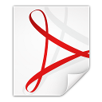

Neude
=====

Digitisation and design of Neude, a typeface in style of Amsterdame School

Introduction
------------

TODO

[voordekunst](https://voordekunst.nl/projecten/4858-digitalisering-en-ontwerp-font-neude-1)

Download
--------

**BETA VERSION!**

Download the OTF file [Neude-beta.otf](https://github.com/z25/neude/blob/master/Neude_beta.otf?raw=true)

Download the TTF file [Neude-beta.ttf](https://github.com/z25/neude/blob/master/Neude_beta.otf?raw=true)

Download the WOFF file TODO

Specimen
--------

Specimins for OTF are:

Download and browse the OTF multi-page PDF specimen [Neude_beta-otf-fntsample.pdf](https://github.com/z25/neude/blob/master/specimens/Neude_beta-otf-fntsample.pdf?raw=true)

Specimins for TTF are:

Download and browse the TTF multi-page PDF specimen [Neude_beta-otf-fntsample.pdf](https://github.com/z25/neude/blob/master/specimens/Neude_beta-ttf-fntsample.pdf?raw=true)

Building
-------

The following software has been used in order to create this font.

[Inkscape](http://inkscape.org)

[FontForge](http://fontforge.github.io)

[git](http://git-scm.com)

Thanks go out to the respective communities for creating and maintianing these.

License
-------

The original design of the thirteen letters on the sculptures found in hall of the [former post office]() at the [Neude]() in [Utrecht]() in [the Netherlands]() was made by [Hendrik van den Eijnde](). The statues were made in the 1920s and the copyright expired on ....

This project, in terms of at least the font files and documentation, has an Open Font License (OFL). This license can be found in the file called [LICENSE](LICENSE) but also on the site of the authors of the license, [SIL International](http://scripts.sil.org/cms/scripts/page.php?site_id=nrsi&item_id=OFL-FAQ_web).

The font foundry for this font is Stichting z25.org.

Sponsors
--------

Main sponsor: [a.s.r. vastgoed vermogensbeheer](http://asrvastgoedvermogensbeheer.nl) en [MRP Development](http://mrpdevelopment.nl)

Co-funing: [Gemeente Utrecht](http://utrecht.nl)

Sponsor als partner van voordekunst: [Prins Bernhard Cultuurfonds](http://cultuurfonds.nl)

Sponsor TODO: [Museum Het Schip](http://hetschip.nl)

Sponsor printed cotton bags: [Katoenfrabriek](http://katoenfabriek.nl)

Sponsored letters
-----------------

The following letters were individually sponsored:
* **B** for Bibliotheek Utrecht http://bibliotheekutrecht.nl
* **H** for Hans by Hans van de Camp http://hansvandecamp.nl
* **Y** for Yppah by Sander Mulder http://www.yppah.com
* **Z** for Zorgtaal by Arnoud van den Eerenbeemt http://zorgtaal.eu
* (rest will be added soon)

Thanks
------

Thanks go to, in alphabetical order:

[Drents Museum](http://drentsmuseum.nl)

[Arjan den Boer](http://arjandenboer.nl)

[BYOB](http://byob.nl)

Presentation at [FOSDEM 2017](http://fosdem.org/2017/schedule/event/osd_architectural_font_digitalisation/) in the Open Source Design devroom.

Help with their crowdfunding platform: [voordekunst](http://voordekunst.nl)

[SETUP](http://setup.nl)

Guest presentation with 3D models of letters in shopping window in city centre of Utrecht: [sudden](http://suddenprojects.nl)

[Hellebaard](http://hellebaard.nl)

[Stichting z25.org](http://z25.org)

[Font Library](http://fontlibrary.org/en/member/z25)

[DaFont](http://dafont.com/profile.php?user=948889)

If we have forgotten to name a person or organisation here, please let us know.

TODO http://neude.z25.org

Support
-------

Plesae, support the futher development of font Neude by making a donation to Stichting z25.org via one of the funding methods below.

[http://patreon.com/z25org](http://patreon.com/z25org)

[http://paypal.com](http://paypal.com)

[http://bountysource.com/people/48717-stichting-z25-org](http://bountysource.com/people/48717-stichting-z25-org)
